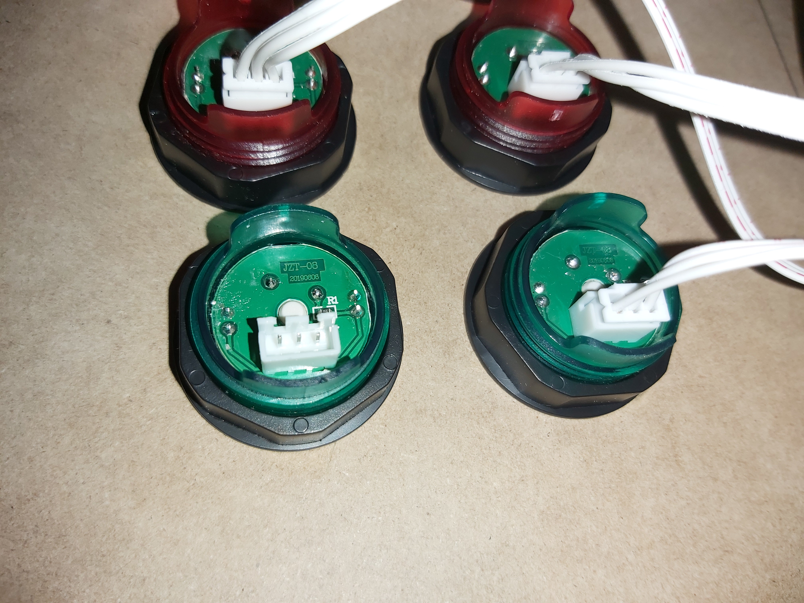

# RPIArcade v1.0
RPI arcade with Arduino UNO LED controls and Arduino Leonardo microcontrollers

Have you ever wanted to play Pac-Man or classic fighting games with retro arcade controls? Now you can! This is a portable, 2 player, arcade that runs on an RPI and is controlled by Arduinos. You can play plenty of awesome classic games solo or with friends. Plus, all the electronics(minus the mointor) can fit inside the box making it decently portable. It has adjustable LED buttons with 4 different modes: ON, adjustable brightness via potentiometer, buttons that flash if any are pressed, and OFF. The LEDs are controlled by an Arduino UNO. On the other hand, I use an Arduino Leonardo and the "Keyboard.h" library instead of a generic controller boards for easily customizeable microcontrollers. The "RetroPie" emulator that I am running on the RPI recognizes keystrokes, but if you wanted to use this with other emulators or with Steam games that are not optimized for keyboard, there is a gamepad library that you can find here: https://github.com/MHeironimus/ArduinoJoystickLibrary.

# What you will need:
|Electronics|:\
RPI (model # from 2-4)\
Arduino Uno (2x for 2 player version)\
Arduino Leonardo (2X for 2 player version)\
MDF planks\
10-20 LED arcade buttons\
1-2 joysticks\
~ 50 male to male jumper wires\
Breadboard\
Micro HDMI cable\
Monitor\
SD card(micro for RPI 3-4)\
|Box/container|:\
Box material(such as mdf planks)\
Spade bit that matches button size\
2 spring loaded latches\
Wood glue\
1 inch screws\
¼ inch screws\
|Optional|:\
USB stick\
Speakers\
Male to male audio jack\
\
|Dependencies|:\
RetroPie Emulator: https://retropie.org.uk/ \
SD Card Formatter: sdcard.org/dowloads \
ApplePi-Baker(Mac): https://www.tweaking4all.com/software/macosx-software/applepi-baker-v2/ \
Win32 Disk Imager(Windows): https://sourceforge.net/projects/win32diskimager/ \
7-Zip(Windows): https://www.7-zip.org/ \
Arduino IDE 1.8.13: https://www.arduino.cc/en/software \
ROMs: Can be legally obtained from the src files, or downloaded from the internet, of games YOU OWN or can no longer be purchased.

# How to Build:
For the box/container... Build a box. Cut all sides to the dimmensions you would like, drill holes into the top for buttons and joystick, screw and glue the sides together, attach the top board via spring latches, and paint if you would like. For most buttons, installation is as easy as pushing them into the holes you have drilled and twisting on a backing by hand to hold them in place. Screw the joysticks into the top of your box and now it's time for wiring. The joystick in my build is pretty easy to connect. There is one wire for ground, and then one wire for, left, right, up, down, in that order from bottom to top. Connect ground to ground, and run the other wires directly to the Arduino Leonardo pins(10, 11, 12, A0). Some cheap joysticks are made like this, but make sure you look up the model if it doesnt appear to be working in this way.

Next, the buttons are a little tricky. The ones I got from amazon only had 3 pins: shared voltage in, voltage out, and ground(top to bottom). For each button you will need to wire the output to a breadboard, then add a resistor that goes to ground.

.jpg)
As you can see, there is an output wire on 50th row of the breadboard then a resistor that eventually leads to ground. After the resistor, you will want a wire that branches from the 50th row of the breadboard to the Arduino Uno pins(4, 5, 6, 7, 8, 9, 10, 12) and one that lead to the Arduino Leonardo pins(2, 3, 4, 5, 6, 7, 8, 9). I then have the voltage in of all the buttons connected to a (+) column on a seperate, smaller breadboard next to the UNO that is controlled by the UNO's pin 3(mainLedPin). I also have the ground wires on the same breadboard, but on a (-) column that is connected to one of the UNO ground pins. To continue on the UNO breadboard, there is an led that is connected to pin 11, a resistor, then ground. This LED acts as a mode indicator for the button LEDs. It is connected seperately from pin 3 in case you wanted animations to show which mode you are on instead of the it acting exactly like the button LEDs. I decided to make it act like the other LEDs anyway because it was helpful during debugging to know whether there was a problem with the software or the button LEDs. There is a simple "INPUT_PULLUP" pushbutton wired from pin 2 then to ground to control the switching of modes. Lastly there is potentiometer from 5v to A0 to ground. This controls the brightness of the LEDs during one of the modes. 
.jpg)
# Full Schematic and Build

.jpg)
Repeat build for the player 2 side.
# RetroPie Installation
(You will need to have downloaded RetroPie, an SD card formatter, and ApplePiBaker from the links above for this section. THIS OS SPECIFIC. I would suggest doing this on a mac if available because it is slightly easier and quicker. I used a mac, so if you only have access to a PC here is a link to help: https://youtu.be/q2KNhY_6byE?t=285) The first step to setting up the RetroPie Emulator is formatting your sd card. This will make sure your SD card is clear and ready for use. Use the SD card formatter, select your SD card from the dropdown menu, and select quick format. After that, open up the ApplePi-Baker make sure your SD card is highlighted then click on the 3 dots to the right. Select the ".img.gz" file you downloaded from RetroPie. Click restore backup and you are good to go. Put your SD card inside of the RPI and connect it to a monitor, power, and a keyboard or controller of choice. Your emulator should be up and running! After this, there is a few ways to add your games. If you want to add games via usb make sure there is nothing on it except a blank folder titled "RetroPie". Plug the usb into the RPI while the emulator is running and give it a few seconds to create the necessary directories. Next, unplug the USB and return to your computer. From there you can drag and drop any ROM into its proper directory on the USB drive (based on console). Plug your USB into your turned-off RPI, then when you start it, your games should be loaded. If your RPI is on, just restart the emulator. If your RPI has Wi-Fi support and you wish to add games over a local network, first connect your RPI to your Wi-Fi network through the emulator, then drag and drop ROMs from your computer into their proper directory. These directories will be found in the Retropie folder in the Network section of Finder or File explorer. Next time you turn on or restart your emulator, your games should be loaded.
# Controller Setup
After you are done setting up the emulator and installing your games, plug in the Arduino Leonardo and Arduino UNO into the RPI. To configure the Leonardo microcontroller, simply go into the menu of the emulator and chose "Configure Inputs". From there, follow the instructions you are provided and you will be set. The keyboard controls programmed onto the Leonardo work best with MAME emulated games, but there are options in RetroPie to configure your controls differently with each emulated system or individual game. I won't get into specifics, but these options are easy to figure out following a youtube search or a few minutes of playing around with RetroPie.
# How to Use (Plug and Play):
Make sure both Arduinos are loaded with their respective program: MicroController.ino for the Leonardos and LightsForProject.ino for the UNOs. All you need to do after that is make sure that the Arduino Leonardo is plugged into the RPI, that the UNO is also plugged into either the RPI or an external power supply, your controls are configured the way you want, and the RPI is connected to power and a monitor. From there, just Turn on your RPI and start playing! Whether you want to blast a new HIGHSCORE onto the Galaga leaderboard or crush your friends in a match of Marvel vs. Capcom, you can do it in style. Open up the box and select your desired LED mode with the pushbutton. Turn the buttons on for a more immersive arcade experience, adjust the brightness to your liking with the potentiometer, have the LEDs flash as you play, or turn off the LEDs to save power. If the buttons ever wear out or you want to customize your arcade box even further, just open up the cabinet top and get to work. If you want your buttons to do different keystrokes, or maybe even a combination of keystrokes *WOW*, just make slight adjustments to the software and get back to gaming! If you really feel like showing-off, take your insane gaming skills AND your insane home arcade build with you anywhere! All you need to do is unplug the power, and HDMI and put it into the box. When you get to one of your Friends' places just plug in the power, HDMI and play!
# Build Team
Jeffery Brown - supervised Levi using the table saw to make sure all of his appendages reamined safe.\
Levi Brown - did eveything else.
# Credits
Brett Withjack - https://www.youtube.com/channel/UCKv99M3K512A3GWlnKYRhRw. Created the project on which mine is based.\
Trevor Tomesh and CS207 - Without his help or the class, this project would not have been possible.  
