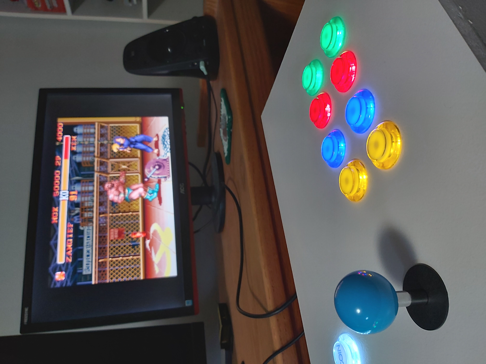
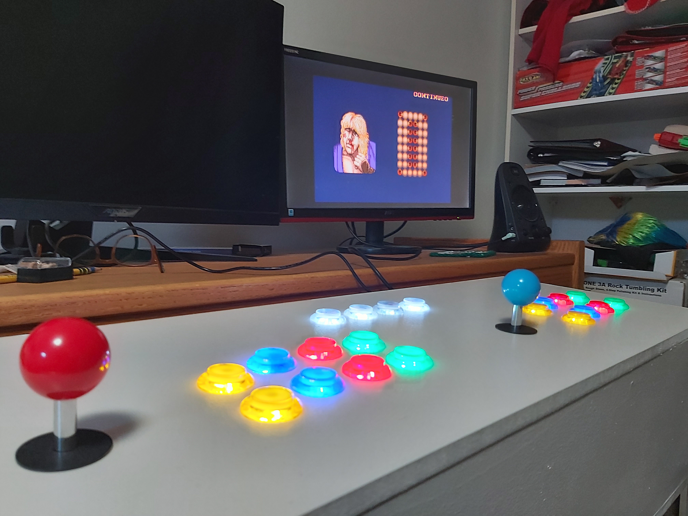
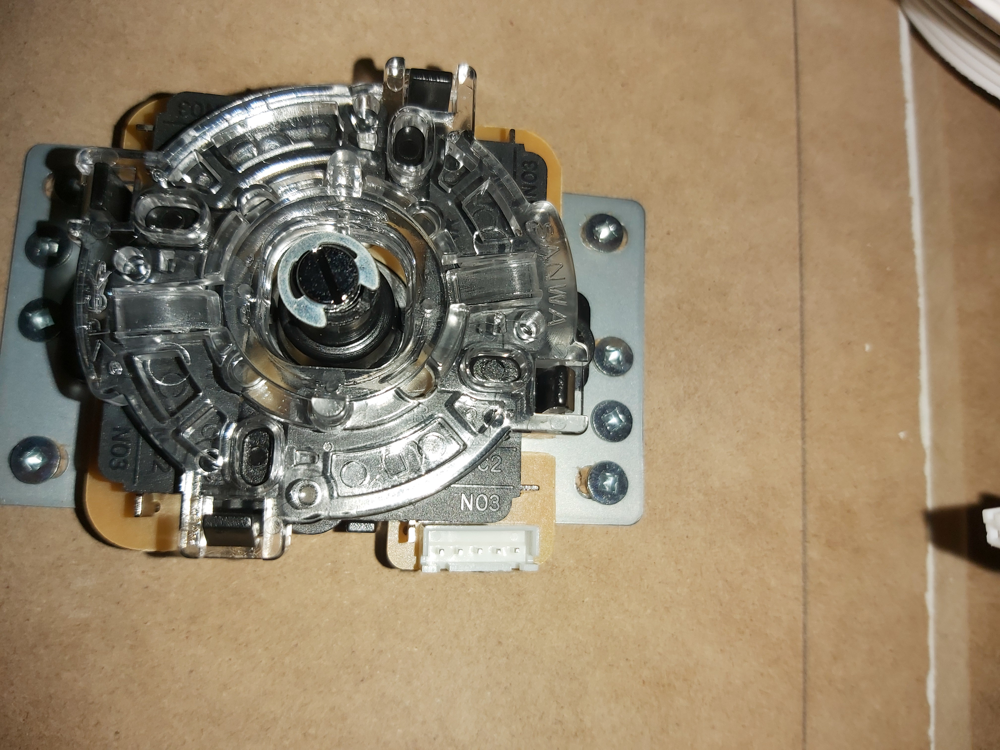
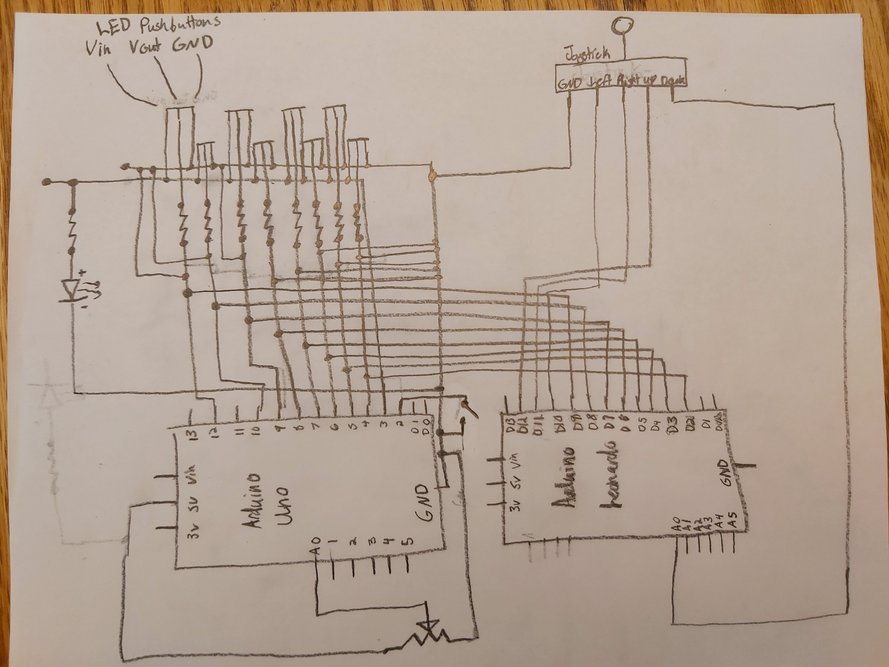

# RPIArcade v1.0
RPI Arcade with Arduino Uno LED controls and Arduino Leonardo microcontrollers

Have you ever wanted to play Pac-Man or classic fighting games with retro arcade controls? Now you can! This is a portable, 2 player, arcade that runs on an RPI and is controlled by Arduinos. You can play plenty of awesome classic games solo or with friends. Plus, all the electronics(minus the mointor) can fit inside the box making it decently portable. It has adjustable LED buttons with 4 different modes: ON, adjustable brightness via potentiometer, buttons that flash if any are pressed, and OFF. The LEDs are controlled by an Arduino UNO. On the other hand, I use an Arduino Leonardo and the "Keyboard.h" library instead of a generic controller boards for easily customizeable microcontrollers. The "RetroPie" emulator that I am running on the RPI recognizes keystrokes, but if you wanted to use this with other emulators or with Steam games that are not optimized for keyboard, there is also a gamepad library that you can find here: https://github.com/MHeironimus/ArduinoJoystickLibrary.

# What you will need:
|Electronics|:
RPI (model # from 2-4),
Arduino Uno (2x for 2 player version),
Arduino Leonardo (2X for 2 player version),
MDF planks,
10-20 LED arcade buttons,
1-2 joysticks,
~ 50 male to male jumper wires,
Breadboard,
Micro HDMI cable,
Monitor,
USB stick,
SD card(micro for RPI 3-4)
|Box/container|:
Box material(such as mdf planks),
Spade bit that matches button size,
2 spring loaded latches,
Wood glue,
1 inch screws,
¼ inch screws
|Optional|:
Speakers,
Male to male audio jack

|Dependencies|:
RetroPie Emulator: https://retropie.org.uk/,
Arduino IDE 1.8.13: https://www.arduino.cc/en/software,
ROMs: Can be legally obtained from the src files, or downloaded from the internet, of games YOU OWN or can no longer be purchased. 

# How to Build:
For the box/container... Build a box. Cut all sides to the dimmensions you would like, drill holes into the top for buttons and joystick, screw and glue the sides together, attach the top board via spring latches, and paint if you would like. For most buttons, installation is as easy as pushing them into the holes you have drilled and twisting on a backing by hand to hold them in place. Screw the joysticks into the top of your box and now it's time for wiring. The joystick in my build is pretty easy to connect. There is one wire for ground, and then one wire for, left, right, up, down, in that order. Connect ground to ground, and run the other wires directly to the Arduino Uno pins. Some cheap joysticks are made like this, but make sure you look up the model if it doesnt appear to be working in this way.   

Next, the buttons are a little tricky. The ones I got from amazon only had 3 pins: shared voltage in, voltage out, and ground. For each button you will need to wire the output to a breadboard, then add a resistor that goes to ground.
.jpg)
As you can see, there is an output wire on 50th row of the breadboard then a resistor that eventually leads to ground. After the resistor, you will want a wire that branches from the 50th row of the breadboard to the Arduino Uno pins(4, 5, 6, 7, 8, 9, 10, 12) and one that lead to the Arduino Leonardo pins(2, 3, 4, 5, 6, 7, 8, 9). I then have the voltage in of all the buttons connected to a (+) column on a seperate, smaller breadboard next to the UNO that is controlled by the UNO's pin 3(mainLedPin). I also have the ground wires on the same breadboard, but on a (-) column that is connected to one of the UNO ground pins. To continue on the UNO breadboard, there is an led that is connected to pin 11, a resistor, then ground. This LED acts as a mode indicator for the button LEDs. It is connected seperately from pin 3 in case you wanted animations to show which mode you are on instead of the it acting exactly like the button LEDs. I decided to make it act like the other LEDs anyway because it was helpful during debugging to know whether there was a problem with the software or the button LEDs. There is a simple "INPUT_PULLUP" pushbutton wired from pin 2 then to ground to control the switching of modes. Lastly there is potentiometer from 5v to A0 to ground. This controls the brightness of the LEDs during one of the modes. 
.jpg)
# Full Schematic and Build

.jpg)
Repeat build for the player 2 side.
